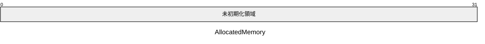
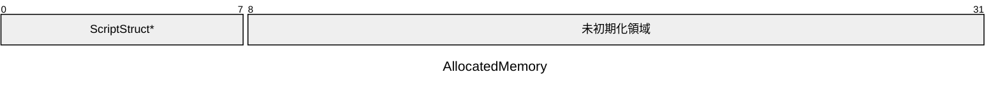
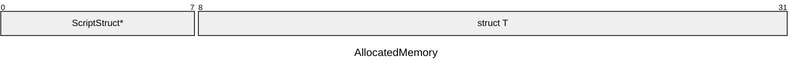

# はじめに
StructUtilシリーズ第二弾です。
本稿は中編です。

* [UE5:Unreal EngineのStructUtilについてまとめた 前編](https://zenn.dev/allways/articles/ue5-structutil-research)
* [UE5:Unreal EngineのStructUtilについてまとめた 中編](https://zenn.dev/allways/articles/ue5-structutil-research-second)
* [UE5:Unreal EngineのStructUtilについてまとめた 後編](https://zenn.dev/allways/articles/ue5-structutil-research-third)

# StructUtilの主要型
再掲。

* `FInstancedStruct`
* `TInstancedStruct`
* `FStructView`
* `FConstStructView`
* `FSharedStruct`
* `FConstSharedStruct`
* `TSharedStruct<T>`
* `TConstSharedStruct<T>`
* `FStructArrayView`
* `FConstStructArrayView`
* `FInstancedStructContainer`

ひとつずつ触れていきましょう。

# `FSharedStruct` と `FConstSharedStruct`

`FInstancedStruct` の メモリ領域を共有するバージョンです。

`FSharedStruct`は`TSharedPtr<FInstancedStruct>`のような機能を持つ構造体です。`FStructSharedMemory`を利用して、共有メモリを直接保持しています。`FInstancedStruct`とは結構異なる実装になっています。

`FSharedStruct` は 同一のメモリ領域を参照カウント方式で共有しています。`FInstancedStruct` をコピーするとメモリがDeepCopyされていましたが、こちらは同一の領域を共有します。BP型のように事前に型を決定できない状況でインスタンスを共有できます。

`FSharedStruct`と `FConstSharedStruct`の違いはメモリ領域を書き換えられるかどうかだけです。
以降は `FSharedStruct` について解説します。

## `FSharedStruct`の作成

`Make`関数を使います。
```cpp
FSharedStruct SharedStruct = FSharedStruct::Make<FFoo>(42);
```

`InitializeAs`関数を使ってもいいです。
```cpp
FSharedStruct SharedStruct;
SharedStruct.InitializeAs<FFoo>();
```

どちらも、内部で `MakeSharable`を利用しています。

## `FSharedStruct`の破棄

`Reset`で明示的に破棄するか、デストラクタで破棄されます。`operator=`でも元の共有参照は破棄されます。破棄されると参照カウントが減ります。参照カウントが0になった時点で内部型`T` のデストラクタ`~T()`が実行されて`Free`されます。

```cpp
void Main()
{
    // 参照カウント1
    FSharedStruct SharedStruct = FSharedStruct::Make<FFoo>(42);

    // 参照カウントが2に増える
    FSharedStruct Shared2 = SharedStruct;

    {
        // 参照カウントが3に増える
        FSharedStruct Shared3 = SharedStruct;
        // 参照カウントが4に増える
        FSharedStruct Shared4 = Shared3;

        Shared4 = {}; // operator= により参照カウントが3に減る
    } // デストラクタで参照カウントが2に減る

    Shared2.Reset(); // 参照カウントが1に減る

}// 参照カウントが0になり~FFoo()を呼び出す＆Freeされる
```

:::message
`MakeSharable` は非侵襲型共有メモリなので、Weak参照が残っていてもFreeされます。
詳しくは [UE5:Unreal Engineのポインタについてまとめた 前編](https://zenn.dev/allways/articles/ue5-unrealcpp-ptr#tsharedptr)をご覧ください。
:::

## `FSharedStruct`の読み書き

`Get<T>` か `GetPtr<T>` で得ます。

`TSharedPtr<T>`と異なりポインタのように振る舞う型ではないので、`operator->`はありません。

```cpp
void Main()
{
    FSharedStruct SharedStruct = FSharedStruct::Make<FFoo>(42);
    FFoo& Foo = SharedStruct.Get<FFoo>();
    Foo.Value = 43;

    FFoo* Foo = SharedStruct.GetPtr<FFoo>();
    Foo->Value = 44;
}
```

:::message
共有しているメモリ領域はスレッドセーフではありません。
Writeアクセス時は気をつけてください。
:::

## `FSharedStruct`の比較
`operator==`でアドレス比較します。メモリ領域のデータ比較は行いません。`nullptr`含め同じアドレスを指していたら一致します。内部では`TSharedPtr`の形で持っておりますが、参照カウンタ等は比較しませんし、`TSharedPtr`の`operator==`も使いません。

```cpp: 疑似コード
TSharedPtr<FStructSharedMemory>　Ptr;

bool operator==(const FSharedStruct& Other)
{
    // ポインタの比較
    return (Ptr->ScriptStruct == Other.Ptr->ScriptStruct)
        && (Ptr->Memory == Other.Ptr->Memory));
}
```
内部データの値が同一であることを期待するような稀有な場面では注意してください。例えば、`TMap`のキーや`TSet`に入れる場合、IDの照合に使う場合などです。どこのメモリ領域にあるかよりも、内容が同じであれば振る舞いとしては同値であってほしい場面も存在します。

```cpp
USTRUCT() 
struct FFString
{
    GENERATED_BODY()
    FString Value;

    bool operator==(const FFString& Other) const
    {
        return Value == Other.Value;
    }
}

static bool CheckPassword(FSharedStruct& Lhs, FSharedStruct& Rhs)
{
    // アドレス比較だよ. パスワードをアドレスで比較しちゃダメだよ
    return Lhs == Rsh;
}

FSharedStruct SharedData1 = Make<FFString>(TEXT("Foobar"));
FSharedStruct SharedData2 = Make<FFString>(TEXT("Foobar"));

void Case0()
{
    bool Result = CheckPassword(SharedData1, SharedData2);

    // どちらも値は"Foobar"で合っているがメモリは異なる場所に確保されているのでfalse
    ensure(Result == false); 

    // ちゃんと共有していたらtrue
    FSharedStruct SharedData3 = SharedData;
    ensure(CheckPassword(SharedData3) == true);
}

void Case1()
{
    // Arrayから "Foobar"な値を探したい
    TArray<FSharedStruct> Datas;
    Datas.Emplace(SharedData1);
    Datas.Emplace(SharedData2);
    auto* Found = Datas.FindByPredicate(
        [Data4=FSharedStruct::Make<FFString>(TEXT("Foobar"))](FSharedStruct& Data)
    {
        return Data4 == Data;
    });

    //この実装では何も見つからないよ
    ensure(Found == nullptr);
}
```
この仕様は汎用共有参照型であるという観点から妥当なものだと思います。同一のメモリ領域を指しているのであれば、ちゃんと共有できており2つのインスタンスは同一であるとみなせますからね。

中身を比較したいなら中身の型を取り出して比較するべきでしょう。

```cpp
bool CheckValueEqual(const FSharedStruct& Lhs, const FSharedStruct& Rhs)
{
    // FFString::operator== を明示的に利用
    bool ValueEqual = Lhs.Get<FFString>() == Rhs.Get<FFString>();
    return ValueEqual;
}
```

## `FSharedStruct`のハンドリング

共有参照が必要なときは`const&`渡しがお勧めです。値渡しの場合は一時オブジェクトにより参照カウントが増えるので、無駄なオーバーヘッドが発生します。

```cpp: const&ハンドリング
FSharedStruct SharedData;

// const& で受け取る
void ReceiveData_Good(const FSharedStruct& InSharedData) //ここで参照カウントは増えない
{
    this->SharedData = InSharedData;
}

// 値渡しでは引数に積まれるときに参照カウントが1増える
void ReceiveData_Bad(FSharedStruct InSharedData) //ここで参照カウント+1
{
    this->SharedData = InSharedData;
}// ここでInSharedDataのデストラクタが発動して参照カウント-1
```
参照カウントを+1して-1するだけの無駄なオーバーヘッドがいますね。

### `FSharedStruct`から Viewへの変換
`FSharedStruct`は`FStructView`/ `FConstStructView`に変換して渡せます。`implicit`変換は無いので明示的にコンストラクタに渡します。
```cpp: Viewへ変換
FSharedStruct SharedData;

void SimpleUseData(FStructView View)
{
    T& Data = View.Get<T>();
}

void Main()
{
    SimpleUseData(FStructView(SharedData));
}
```
値を使いたいだけならば、こちらでよいです。Viewを引数にとるシグネチャを持つ 関数や`Delegate`型に渡せて便利です。
逆に`FStructView`から `FSharedStruct`へは変換できませんから、所有権に興味がない場面においては`FStructView`の値渡しが適切です。


## `FSharedStruct`は UPROPERTY対応

`FSharedStruct`は`UPROEPRTY`対応です。`TSharedPtr<T>`は`UPROPERTY`ダメなので助かります。

```cpp
UCLASS()
class UHoge : public UObject
{
    GENERATED_BODY()

private:
    UPROPERTY() FSharedStruct SharedData;
    UPROPERTY() FConstSharedStruct ConstSharedData;
}
```

なお`EditAnywhere`を付けても Detailsビューでは編集できませんでした。

## `FSharedStruct`は `Blueprint` 非対応

BPダメです😿

> `Error  : Type 'FSharedStruct' is not supported by blueprint.`

```cpp
// ダメ
UFUNCTION(BlueprintCallable)
void SetSharedData(const FSharedStruct& InSharedData);

// ダメ
UFUNCTION(BlueprintCallable)
void SetSharedData(FSharedStruct InSharedData);

```

# `FSharedStruct` 詳解
本題です。`FSharedStruct`の謎に迫ります。

`FSharedStruct`は 共有ポインタを持つラッパーです。単純に`TSharedPtr<FInstancedStruct>`をラップしてしまうとダブルポインタ操作になってしまい、キャッシュミスが増えます。これを避けるための工夫が施されています。

色々省略すると次の通りになります。
```cpp: 疑似コード
struct FSharedStruct
{
    TSharedPtr<FStructSharedMemory> Memory;
}
```
本体は`FStructSharedMemory`ですね。


以下`FStructSharedMemory`の疑似コードです。
```cpp: 疑似コード
struct FStructSharedMemory
{
    TObjectPtr<const UScriptStruct> ScriptStruct;
    uint8 Memory[0];
}
```
型情報とメモリ領域をもっており、`FInstancedStruct`と同じ感じです。
データ領域は`uint8*`ポインタかと思いきや長さ0の配列を持っていますね。キモイですね。

こちらは`Flexible array member`パターンというものです。C言語ではC99でサポートされていますが、C++では正式サポートされてたかよくわかりませんでした。でもまぁ動いているんでサポートされているんでしょう！(しらね)

フレキシブル配列ですが、次のような雰囲気でメモリ確保します。
理解を助けるために簡単化した疑似コードです。

```cpp: 疑似コード
//1. メモリ確保
const int32 ToalMemSize = sizeof(FStructSharedMemory) + sizeof(T);
uint8* AllocatedMemory = FMemory::Malloc(ToalMemSize);

//2. 制御領域のオブジェクト構築
new (AllocatedMemory) FStructSharedMemory();
FStructSharedMemory* SharedMem = reinterpret_cast<FStructSharedMemory>(AllocatedMemory);

//3. データ領域のオブジェクト構築
uint8* StructAreaMemory = SharedMem->Memory;
new (StructAreaMemory) T();

//4. SharedPtrを作る
TSharedPtr<FStructSharedMemory> Ptr = MakeSharable<FStructSharedMemory>(AllocatedMemory, CustomDeleter);
return FSharedStruct(Ptr); //インスタンスできた
```


### 制御ブロックも含めてメモリ確保
順番に解説します。
重要な点は どかんと連続した領域にメモリ確保していることです。
```cpp
// 1.メモリ確保
const int32 ToalMemSize = sizeof(FStructSharedMemory) + sizeof(T);
uint8* AllocatedMemory = FMemory::Malloc(ToalMemSize);
```
まず、`TotalMemSize`を求めましょう。
`sizeof(TObjectPtr<T>)`は8byteです。`TObjectPtr`は生ポとサイズが一致するように厳密に実装されているからです。次に、長さ0の配列`uint8 Memory[0];`は0byteです。
よって`sizeof(FStructSharedMemory)` は8+0=8byteです。

`sizeof(T)`の部分はアラインメントも考慮されて定まります。実際は`UScriptStruct`から得られます。説明のために、仮に24byteであると仮定して話を進めます。`TotalMemSize`は8+24=32byteとなりました。

以下に32byte確保した様子を図示します。
(パケット図は本当はbit表記だけどbyteで読んでください)


`FMemory::Malloc`で初期化なしに確保します。


### 制御領域のオブジェクト構築
次に配置newこと`placement new` でメモリ領域にオブジェクトを構築していきます。
構築は2回行います。最初は制御領域である`FStructSharedMemory`部分を構築します。先頭アドレスから `sizeof(FStructSharedMemory)` 分構築します。`sizeof(FStructSharedMemory)` は8byteでしたね。


```cpp
//2. 制御領域のオブジェクト構築
new (AllocatedMemory) FStructSharedMemory();
FStructSharedMemory* SharedMem = reinterpret_cast<FStructSharedMemory>(AllocatedMemory);
```

`placement new` によって下図のように8byte構築されました。



### データ領域のオブジェクト構築
次にデータ領域を構築していきます。フレキシブル配列メンバーの場合、`FStructSharedMemory::Memory[0]`は8byteだけoffsetされた位置を差しています。
そこを `T`型で構築します。

```cpp
//3. データ領域のオブジェクト構築
uint8* StructAreaMemory = SharedMem->Memory;
new (StructAreaMemory) T();
```



上記手順により `AllcatedMemory`は無事構築されました。

### TSharedPtr作って終わり
あとは`TSharedPtr`に渡すだけです。今回は特殊な初期化をしてしまったので、単純なdelete では解放できません。正しく実装したカスタムデリータを渡します。

```cpp
//4. SharedPtrを作る
TSharedPtr<FStructSharedMemory> Ptr =
             MakeSharable<FStructSharedMemory>(AllocatedMemory, CustomDeleter);
return FSharedStruct(Ptr); //インスタンスできた
```


上図の`FSharedStruct::TSharedPtr<T>::Ptr`の部分が `AllocatedMemory`の先頭を指しています。

カスタムデリータは本質ではないので、疑似コードです。`Malloc`の返り値をつかって`Free`します。実際はラムダ式ではありませんが、雰囲気が分かればいいでしょう。
```cpp: 疑似コード
auto CustomDeleter = [=AllocatedMemroy]()
{
    FMemory::Free(AllocatedMemory);
};
```

### なぜこんな面倒くさいことをしているのか
`Flexible array member`パターンを利用することで、制御ブロック含め連続したメモリ領域に確保することでキャッシュヒット率をあげたいからです。素直に `TSharedPtr<FInstancedStruct>`を使ってしまうと、ダブルポインタのダブルデリファレンスにより2連続で`load`命令が発生する可能性がとても高いです。

1. `TSharedPtr<FInstancedStruct>::Ptr` のデリファレンスと`load`命令
2. `FInstancedStruct::Memory`のデリファレンスと`load`命令

具体的に`TSharedPtr<FInstancedStruct>`を使ったときを考えます。
```cpp: ダブルデリファレンス
TSharedPtr<FInstancedStruct> SharedPtr;
// 1回目のデリファレンス
FFoo* FooPtr = SharedPtr->GetPtr<FFoo>();
// 2回目のデリファレンス
(*FooPtr) = FFoo(100);
```

上記はそれぞれが`Malloc`しているため、別々のヒープに確保される可能性が高いです。
`SharedPtr::Ptr`の指すアドレスが`0x12345678_00000000`だとしたら`FooPtr` の指すアドレスは`0xdeadbeaf_ffffffff`ぐらい離れているかもわかりません。
L1キャッシュサイズよりも離れていたらL2キャッシュから、そこよりも離れていたらL3キャッシュ...　とloadされるでしょう。間に4kテクスチャやvoiceデータが挟まっていたらどれだけ離れるか見当もつきません。

```
TSharedPtr<FInstancedStruct>
│
└── Ptr (0x12345678_00000000) ──▶ [FInstancedStruct]
                                     │
                                     └── Memory (0xdeadbeaf_ffffffff) [FFoo]
```

では `FSharedStruct`の場合はどうでしょうか？
```cpp
FSharedStruct SharedData = FSharedStruct::Make<FFoo>();
// 1回目のデリファレンス
FFoo* FooPtr = SharedData.GetPtr<FFoo>();
// 2回目のデリファレンス
(*FooPtr) = FFoo(100);
```

デリファレンス自体は2回発生していますね。ただし、2回目のデリファレンスでは、すぐ近くを指します。`FSharedStruct::Ptr`の指すアドレスが`0x12345678_00000000`だとしたら`FooPtr` の指すアドレスは`0x12345678_00000008`です。
これだけ近いとキャッシュラインにのっており、`data prefetch`により一緒に`load`済みであろうから、L1キャッシュに高確率でキャッシュヒットするはず。あっという間に`FFoo`本体へ書き込みが実行されるでしょう。

```
FSharedStruct
│
└── Ptr (0x12345678_00000000) ──▶ [AllocatedMemory]
                                     │
                                     └── ScriptStruct (0x12345678_00000000) 
                                     └── Memory       (0x12345678_00000008) [FFoo]
```

--- 
# TSharedStruct

`TSharedStruct<T>`は `FSharedStruct` の型付け版です。
`TInstancedStruct<T>`の　メモリ共有版とも言えます。

型付けの有無と, メモリ所有権の2軸で表にするとこんな感じ。

|     | 汎用 | 型付け | 
| --- | --- | --- |
|**所有**| `FInstancedStruct` | `TInstancedStruct<T>` |
|**共有**| `FSharedStruct` | `TSharedStruct<T>` |


## `TSharedStruct<T>`の作成
`FSharedStruct`と全く一緒です。
新たな共有メモリを確保して、その領域を与えられた引数で構築します。引数は捨てて構いません。

```cpp: 初期化
TSharedStruct<FFoo> SharedData = TSharedStruct<FFoo>::Make();

TSharedStruct<FFoo> SharedData;
SharedData.InitializeAs<FFoo>();
```

APIも性能も全く一緒です。なぜならば、`TSharedStruct::Make`と`TSharedStruct::InitializeAs`は内部で`FSharedStruct::Make`, `FSharedStruct::InitializeAs`を使っているからです。

## TSharedStructの破棄
`FSharedStruct`と全く一緒です。

## TSharedStructの読み書き
`FSharedStruct`と一緒です。
静的型付けされているため、`template`パラメータは省略可能です。

```cpp: 読み書き
TSharedStruct<FFoo> SharedData = TSharedStruct<FFoo>::Make();
// templateパラメータを省略するとデフォルトパラメータでFFooが渡される
FFoo& Foo = SharedData.Get(); 
```
型推論ではなく[テンプレートパラメータのデフォルト引数](https://cpprefjp.github.io/lang/cpp17/allow_default_template_arguments_of_variable_templates.html)機能です。


## TSharedStructの比較
`FSharedStruct`と全く一緒です。アドレス比較です。
固定のID型は共有しがちなので、やりがち。

```cpp: 怪しい例
USTRUCT() struct FFGuid{ GENERATED_BODY() FGuid Guid; }

// どちらも同じIDだけどfalseだよ
TSharedStruct<FFGuid> VenderID1 = TSharedStruct<FFGuid>::Make(1,2,3,4);
TSharedStruct<FFGuid> VenderID2 = TSharedStruct<FFGuid>::Make(1,2,3,4);
ensure(VenderID1 != VenderID2);
```

型付けされている分やりがちかも？？？こういうコードをAIに書かれたときに気づけるかどうか自信ないです。
```cpp: 怪しい例
using FStatusCode = TSharedStruct<FHttpStatus>;
static const FStatusCode NotFound = FStatusCode::Make(404);
void OnReceive(const FStatusCode& StatusCode)
{
    if(StatusCode == NotFound) // 論理的にbug
    {
        // 値が404でもアドレスが違うのでここには来ない...
    }
}

void Publish404()
{
    OnReceive(FStatusCode::Make(404));
}
```
---
# `TSharedStruct<T>` 詳解
本題その2です。

`FSharedStruct` の説明と大体同じです。

## `TSharedStruct<T>` は `FSharedStruct`として扱われる

```cpp: 疑似コード
template<class T>
struct TSharedStruct
{
    FSharedStruct Data;
}
```

リフレクション層では、`TSharedStruct`は `FSharedStruct`として扱われます。
シリアライズなどもsupported です。

その他テンプレート的な特徴は `TInstancedStruct<T>` で説明したことと同じです。

## `TSharedStruct<T>` は 標準レイアウト型
`standard_layout`です。メモリレイアウトははっきりしています。すごい。

```cpp: 疑似コード
USTRUCT() struct FFoo{ GENERATED_BODY() int Value;}

// 全部OK
static_assert(std::is_standard_layout_v<FStructSharedMemory>);
static_assert(std::is_standard_layout_v<TSharedPtr<FStructSharedMemory>>);
static_assert(std::is_standard_layout_v<FSharedStruct>);
static_assert(std::is_standard_layout_v<TSharedStruct<FFoo>>);
```

`standard_layout`だと何がうれしいのかというと、

1. `EBO:Empty base optimization`の条件を1つ満たす
1. `this`を`reinterpret_cast`で最初の非静的メンバーを指すポインタへ合法的に変換できる
1. `offsetof` が合法的に使える
1. `ABI:Application Binary Interface`を満たす

`TSharedStruct<T>`は なぜ`FSharedStruct`として扱っていいのかという答えがここにあります。
> `reinterpret_cast`で最初の非静的メンバーを指すポインタへ合法的に変換できる

```cpp: first non-static data member
struct TSharedStruct
{
    FSharedStruct Struct;
}

void Main()
{
    TSharedStruct<FFoo> Data;

    //これは当然
    FSharedStruct* Ptr0 = &Data.Struct;

    // standard_layoutなら合法
    // オブジェクトのfirst non-static data memberへはreinterpret_castできる
    FSharedStruct* Ptr1 = reinterpret_cast<FSharedStruct*>(&Data);
    ensure(Ptr0 == Ptr1);
}
```

# 共有参照カウント式スマートポインタ対応表

`FSharedStruct`の登場により対応表が出揃いました。

|ベース型 | 共有コンテナ型 | 
| --- | --- |
| `UObject*`型 | `TStrongObjectPtr<UObject>` |
| `USTRUCT*`型 | `FSharedStruct` |
| `Native*`型  | `TSharedPtr<FNative>` |

`UObject*` に対する参照カウント方式共有参照は `TStrongObjectPtr<T>`
`USTRUCT*` に対する参照カウント方式共有参照は `FSharedStruct`
`Native`型に対する参照カウント方式共有参照は `TSharedPtr<T>`です。

---

# つづく
